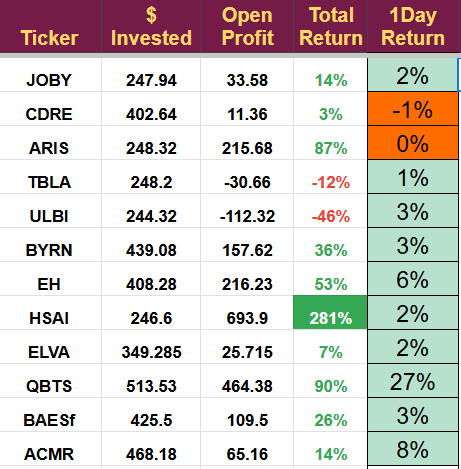

# Note -- March 14, 2025

Another great day, D-Wave continues to make excellent progress and the majority of our stocks are showing a profit today.

Amazingly we have just moved into positive territory for the month. Despite the LUNR collapse, the SES loss and the general market fall our portfolio is now up over 2% in March! Its not a huge figure but is such a turnaround from a week or so ago when we were down almost 15%. It does mean that we are crushing the benchmarks once again which I love.

---

*Source: [Strategic Wave Trading Notes](https://stephentobin.substack.com)*
