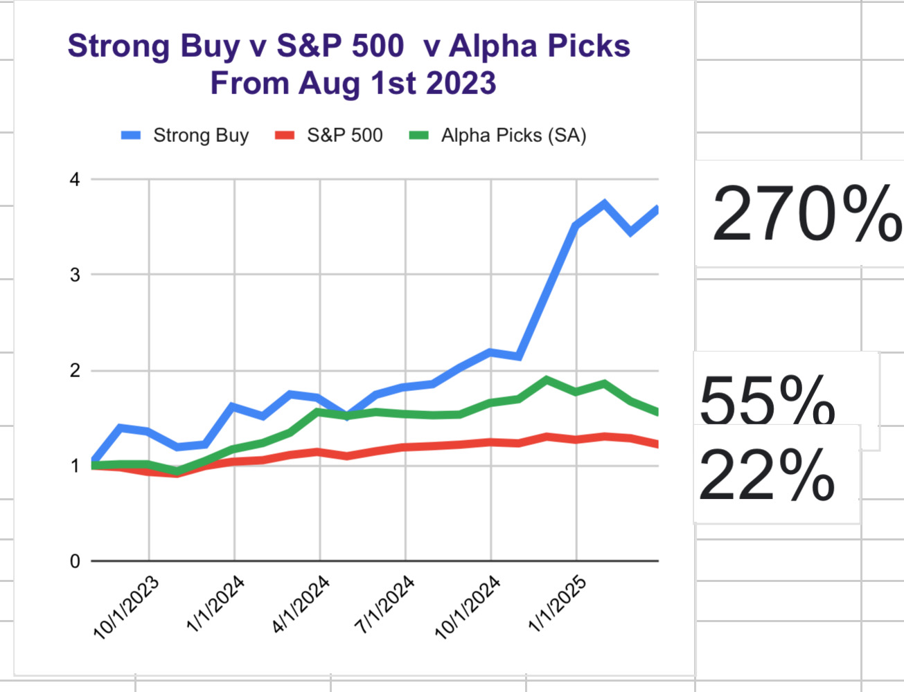

# Note -- March 17, 2025

With several stocks making good progress the portfolios fall in February is beginning to look like a thing of the past. The nature of the political situation means we expect more volatility but we have a much better balance of stocks now. Less than 50% in the US for the first time in a lot of years. Still hoping to make two new trades this month and will add to some if we get the chance. We missed the chance to add to Hesai again which is really annoying. Almost finished writing up a new article on ELVA just trying to check my forecasts before sending it to print.

---

*Source: [Strategic Wave Trading Notes](https://stephentobin.substack.com)*
