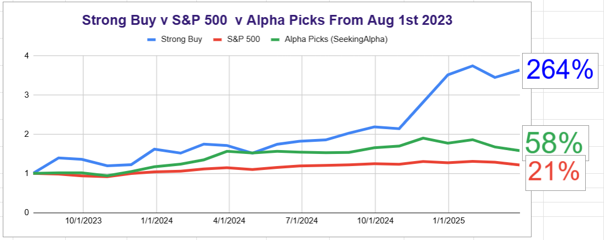

# Note -- March 18, 2025

2025 Trading Update: A Few Bumps, But Still Cruising!

Hey everyone,

So, I wanted to give you a quick rundown of how my trading has been going so far in 2025. It's been... interesting, to say the least! Let's be real, it hasn't been a straight shot to the moon (LUNR I have not forgotten you), but overall, I'm definitely still in the green.

First off, I've closed out eight positions this year. Four of those were winners, overall, those closed trades gave me a solid 37% return. Not too shabby, right?

Now, for the open positions. I've got eleven of those running right now, and eight of them are currently in profit. The current unrealized profit on those open positions is sitting at around 35%. So, things are looking pretty good there too.

We did hit a bit of a rough patch last month. You know how it goes, the market drops, and you just have to roll with it. But thankfully, it seems like things have turned around nicely, and we're back on track.

One of the big moves I made in January was to rebalance my portfolio. I decided to dial back my exposure to new energy stocks and beef up my holdings in European and Chinese stocks. And honestly, that decision has paid off big time! It's always satisfying when a calculated risk works out.

Looking ahead, I've got my eye on a few high-probability trades. I'm hoping to pull the trigger on at least two more positions before the end of this month. Always on the lookout for opportunities! Subscribe if you want to hear about them

And just to give you a bit of a bigger picture, here’s a graph showing my portfolio's performance since I started sharing my performance 20 months ago. As you can see, even with the recent small dip, we are still up a massive 264%.

That's a testament to sticking to a strategy and not panicking when things get a little bumpy.

So, there you have it! A quick and dirty update on my 2025 trading adventures. It's been a mix of wins and a few learning experiences, but overall, I'm happy with the progress.

As always, I'll keep you posted on how things are going. Stay tuned for more updates, and happy trading!

---

*Source: [Strategic Wave Trading Notes](https://stephentobin.substack.com)*
