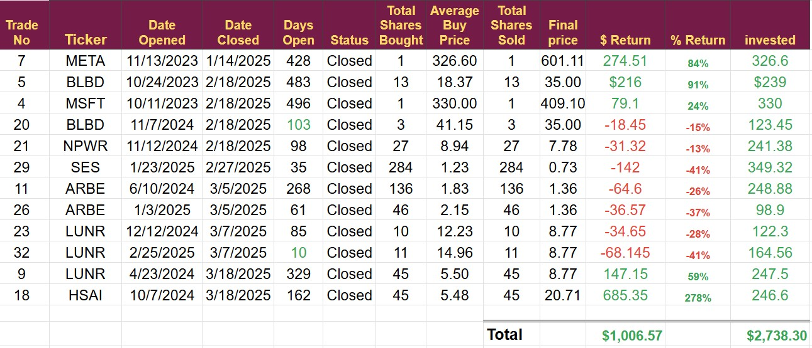

# Note -- March 20, 2025

The Importance of Position Sizing: Protecting Your Capital in High-Risk Investments

When it comes to investing in high-risk, small-cap companies, one of the most crucial factors for long-term success is proper position sizing. Understanding and implementing sound position sizing strategies can significantly reduce your risk and improve your chances of achieving your investment goals.

Why Position Size Matters

Small-cap companies, while offering the potential for substantial growth, are inherently more volatile and susceptible to market fluctuations than larger, more established businesses. A seemingly promising small company can face unexpected challenges, such as:

Lack of funding

Disappointing results

Regulatory hurdles

Competitive pressures

Unforeseen economic downturns

Any of these factors could cause a significant decline in the company's stock price, potentially leading to substantial losses if your position size is too large.

Limiting Losses, Maximizing Opportunities

The primary goal of position sizing is to limit the amount of capital you risk on any single investment. By keeping your position size small, you can:

Protect your portfolio: Even if one of your high-risk investments goes south, the impact on your overall portfolio will be limited.

Maintain flexibility: Small position sizes allow you to diversify your holdings across a larger number of companies, increasing your chances of capturing big wins.

Reduce emotional decision-making: When you have less money at stake in a single investment, you're less likely to panic and make impulsive decisions during market downturns.

My Approach: Prioritizing a Low Entry Price

My personal approach to position sizing incorporates the importance of buying at a low price. Here's how I manage my investments:

Initial Investment: I aim to make my first investment in a company at a low price, relative to my estimate of its intrinsic value. This initial position is sized conservatively, I choose a fixed amount of dollars and keep it below 5% of my total portfolio.

Scaling Up (Cautiously): If the company's stock price appreciates and I continue to believe in its long-term potential, I may add to my position. However, I buy less than I did initially. This approach allows me to build the position but keeps the risk down and allows me to escape if things go wrong

Example:

Intuitive Machines (LUNR) . I believed the company was significantly undervalued when I bought it at  $5.50 per share in March last year, so I purchased 45 shares ($250 was my fixed position size at the time. I bought twice more at $12.23 and $14.96 but only bought 10 or 11 shares. This strategy meant that when the company's moon lander crashed, and the share price went with it, I could escape with minimum damage to the portfolio.

The Bottom Line

Investing in small-cap companies can be exciting and rewarding, but it requires a disciplined approach to risk management. By prioritizing position sizing and focusing on buying at low prices, you can significantly improve your chances of achieving long-term success while protecting your hard-earned capital.

I have added a detailed view of all the trades closed in 2024, so you can see the policy in action. I only invest $250 a month in this portfolio, and it delivered over $1,000 in closed trade profit in 2025.

It means the portfolio is now cash-heavy, and I can increase my position size again, this time to $500. This is compounding in action. If I have the same performance in the first three months of next year, my profit will be up 100% because the position sizes are bigger but I will still only be investing $250 a month. 

Please subscribe to hear about every trade in advance.

---

*Source: [Strategic Wave Trading Notes](https://stephentobin.substack.com)*
