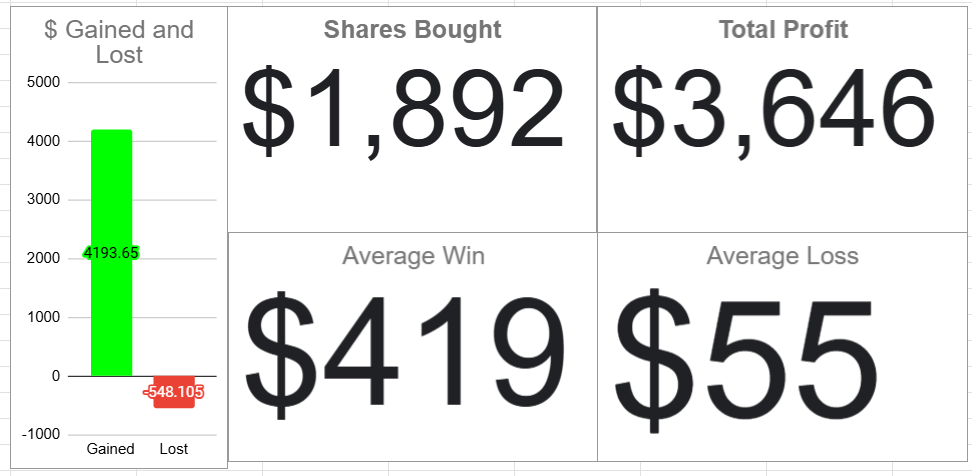

# Note -- March 30, 2025

March update with one day to go: Down 4%, making it my second losing month in a row. It's a reminder that investing is a marathon, not a sprint. Here's a look at all closed trades since I started my demonstration portfolio in Aug 2023. $250 invested monthly in IBKR US, with every move shared in my newsletter. #Investing #Transparency #LongTerm

---

*Source: [Strategic Wave Trading Notes](https://stephentobin.substack.com)*
