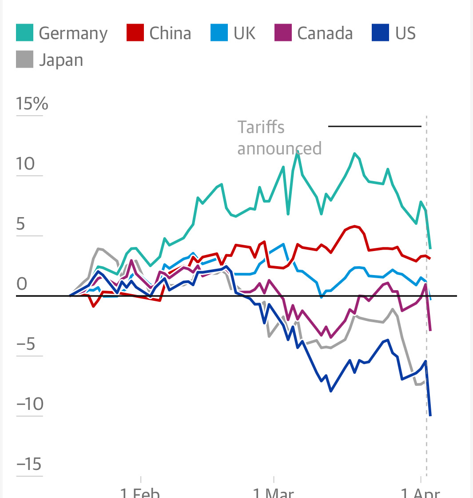

# Note -- April 4, 2025

China appears to be holding up best against the US tariff changes. I have been rotating into China and have a new trade for next week (would have been today but China and HongKong markets closed for a holiday).

---

*Source: [Strategic Wave Trading Notes](https://stephentobin.substack.com)*
