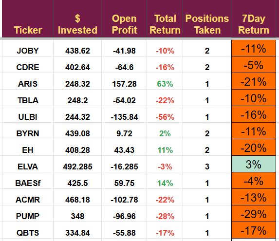
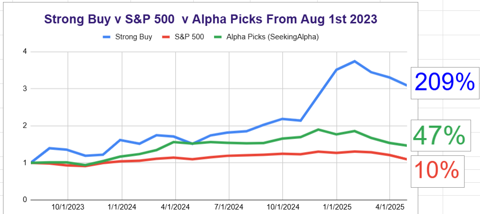

# Note -- April 5, 2025

Carnage, in years to come, we can say we traded through the Trump tariffs! I can add it to my list of Covid, the Credit Crunch, and the dot-com bubble.

Luckily, experience helped me see the impending problem and move half of the portfolio to cash, where it is earning interest, and means I have a lot of dry ammo to use in the coming weeks.

The only good, well, relatively good news is how the portfolio is outperforming the S&P and Alpha Picks, our two benchmarks.

---

*Source: [Strategic Wave Trading Notes](https://stephentobin.substack.com)*
