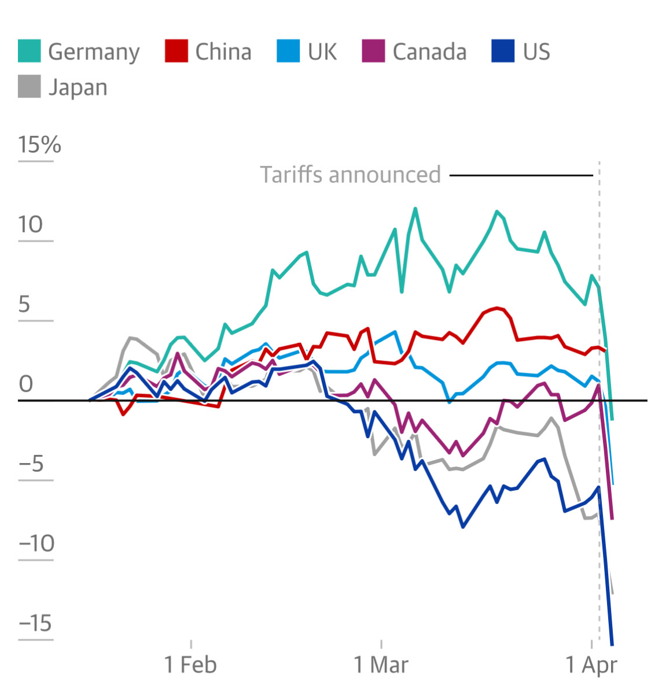

# Note -- April 6, 2025

The latest data paints a grim picture. This updated graph, reflecting China's swift retaliation to last week's sanctions, reveals a disturbing trend. Germany has now joined the US in a precipitous decline, while China stands defiant. In light of this stark reality, my strategic pivot towards China will not only continue, but intensify.

---

*Source: [Strategic Wave Trading Notes](https://stephentobin.substack.com)*
