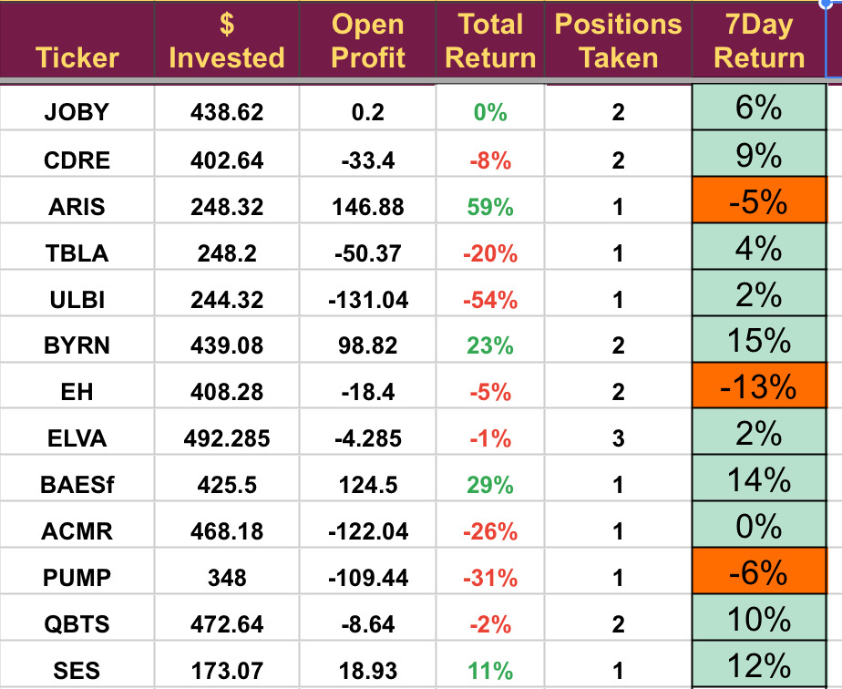

# Note -- April 12, 2025

A recovery week for the portfolio, we opened the SES position (again) and plan to increase it in the future as well as adding to QBTS. Still trading in caution mode. Currently writing up a review of Byrna in light of last weeks earnings and will send to subscribers.

---

*Source: [Strategic Wave Trading Notes](https://stephentobin.substack.com)*
