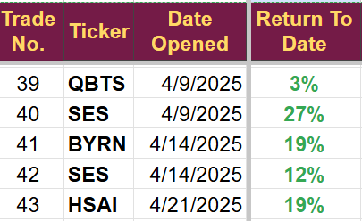

# Note -- April 23, 2025

With Hesai, D-Wave, and Acmr all up more than 10% today, the portfolio has moved into profit for the month. 

Still looking at several more trades for the month, I have been very active this month, but it’s an actively managed portfolio! The Trump announcements on Tariffs with China caught me off guard this morning, and some of the investments I was considering look a little less appealing than they did 24 hours ago. Still, I expect at least two more trades this month.

Trades taken this month are shown below.

---

*Source: [Strategic Wave Trading Notes](https://stephentobin.substack.com)*
