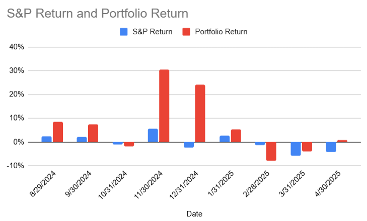

# Note -- April 24, 2025

Approaching 9 months of the second year reporting my trading perfromance. I have a cumulative return of 101%, the S&P 500 is at -2% over the same period. I beat the S&P in 7 of the 9 months! new trade alert issued today and it is already showing a good return

---

*Source: [Strategic Wave Trading Notes](https://stephentobin.substack.com)*
