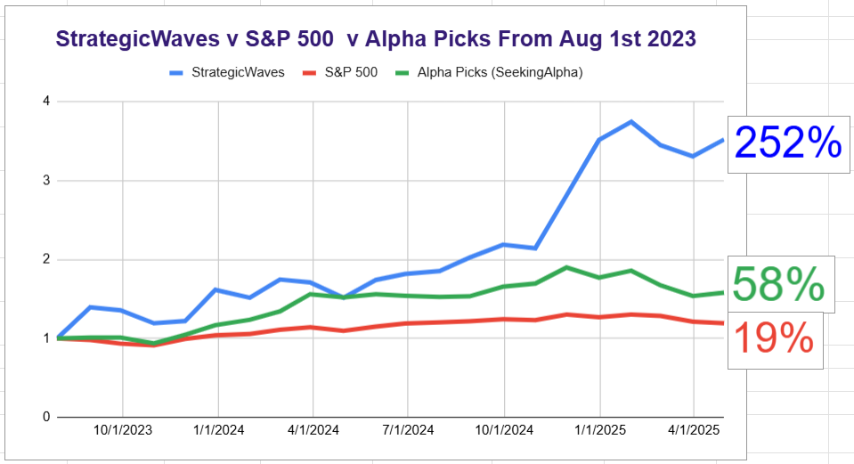

# Note -- April 29, 2025

$PONY and $SES are driving the portfolio higher at the moment. SES is a good example of my active management style. I exited at $0.73 for a loss and then rebought at $0.57. I was able to buy twice as many shares, profit from the new trade has more than cancelled the earlier loss, reflected in the sharp uptick below.

---

*Source: [Strategic Wave Trading Notes](https://stephentobin.substack.com)*
