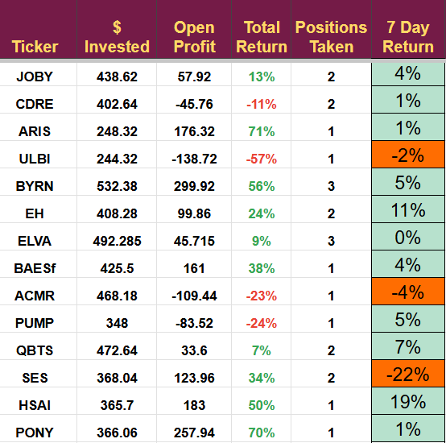

# Note -- May 4, 2025

Another good week, our stocks were up 4.4%, but results were mixed in comparison to last week. SES shot up 51% last week and has pulled back this week. It has a novel business model with no peers to compare with likely leading to this volatility. Although PONY was only up 1% in the week it has returned 70% in 10 days so we can’t complain, one more RoboTaxi orientated trade on Monday it will take us to my 20% limit per sector.

---

*Source: [Strategic Wave Trading Notes](https://stephentobin.substack.com)*
