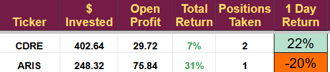

# Note -- May 7, 2025

Earnings season: CDRE is up 20% on a beat, and ARIS is down 22% on a miss. Cadre continues to expand its mission-critical safety sales and grow its margins. Interestingly, debt was down significantly and cash up - in the past, this has signalled that an acquisition is close. Aris is being hit hard by the low oil price. I worked out my target based on $70 a barrel, and we are a long way below that. The earnings call will be important. If the new businesses are going well, I may add, if not, it might be time to exit with a small profit. Luckily, we have more invested in Cadre than Aris, so the portfolio is having an OK day

---

*Source: [Strategic Wave Trading Notes](https://stephentobin.substack.com)*
