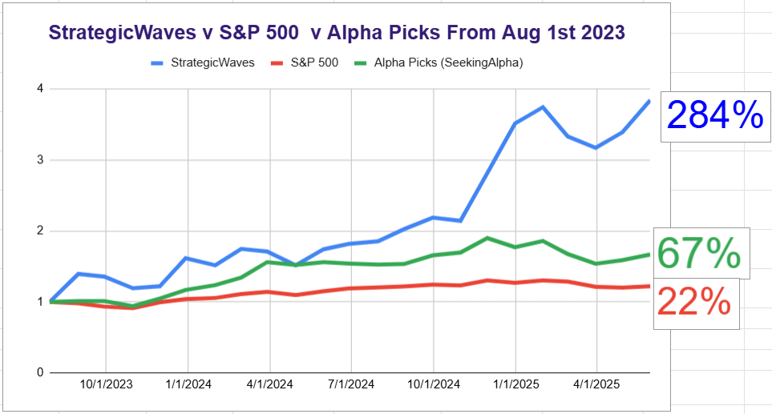

# Note -- May 12, 2025

China and US agree to slash tariffs by 115%, the entire tariff strategy seemed flawed. At least the US has realized quickly. Our China heavy portfolio is likely to do extremely well today, should be a great day! I started to pivot into China in January and managed to get a quarter of the portfolio into Chinese based operations (although all US traded).

---

*Source: [Strategic Wave Trading Notes](https://stephentobin.substack.com)*
