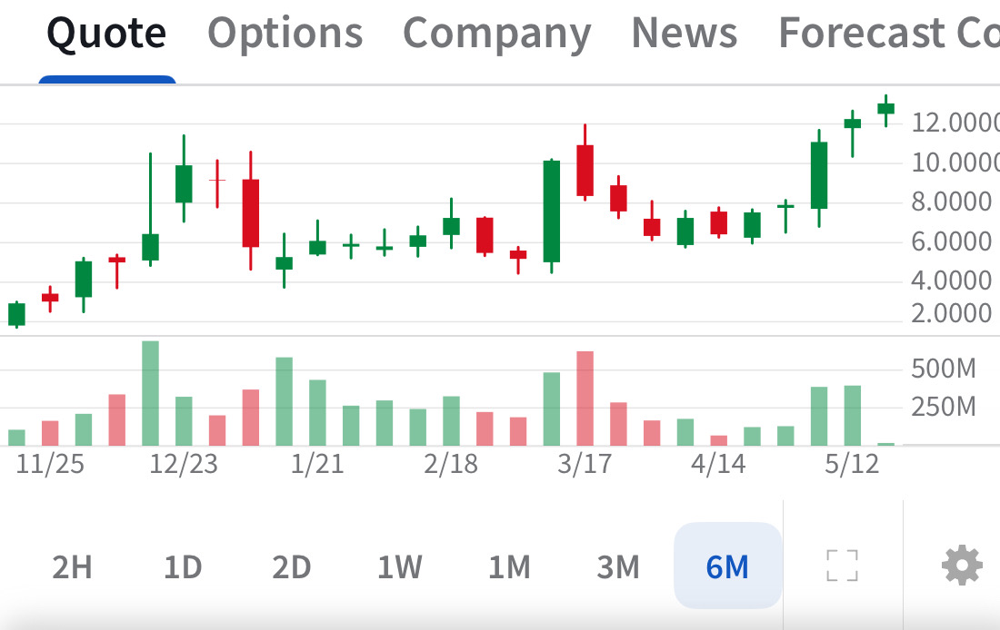

# Note -- May 19, 2025

QBTS seems to be confirming the break of $12, bounces off it today and now above $13. Short sellers may have to close, a lot of short interest so this could be a nice profit.

---

*Source: [Strategic Wave Trading Notes](https://stephentobin.substack.com)*
