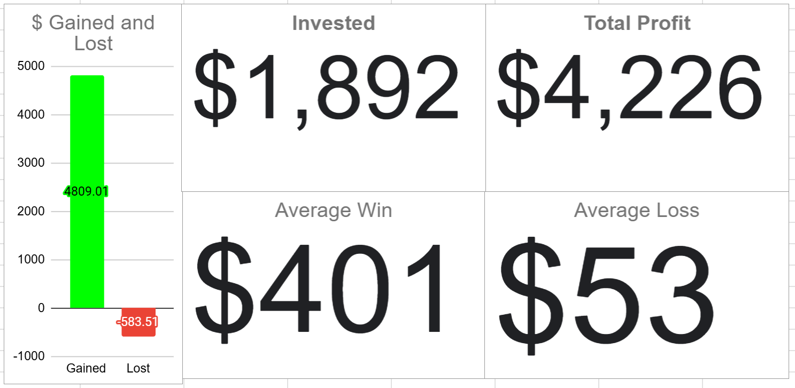

# Note -- May 22, 2025

After closing QBTS yesterday for 147% profit, the cash balance on the demonstration account is back over 30%. It continues to be very profitable, showing a 313% return since inception in Aug 2023. The prospect list is robust, and it has multiple high-potential investments that meet our criteria. The chart only shows the performance of closed trades. (I only invest $250 a month in this account, putting the performance into context)

---

*Source: [Strategic Wave Trading Notes](https://stephentobin.substack.com)*
