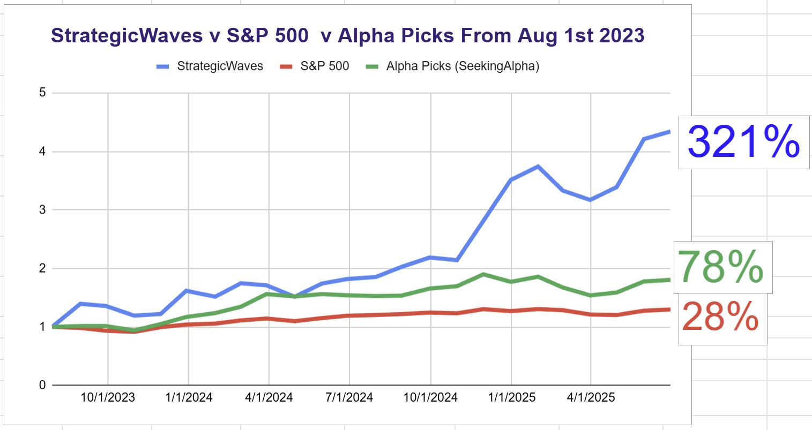

# Note -- June 6, 2025

Another trading week coming to an end, Portfolio is showing +3% for the week and 7 of our 16 positions showed double digit gains during the week. I closed $PONY for 100% gain but not convinced I made the right decision, we often get caught between conflicting ideas and have to make the best decision we can. The last 14 trades taken are all in profit and I have identified at least 3 new trades for next week, I still have alot of cash on the portfolio and want to get it to work.

---

*Source: [Strategic Wave Trading Notes](https://stephentobin.substack.com)*
