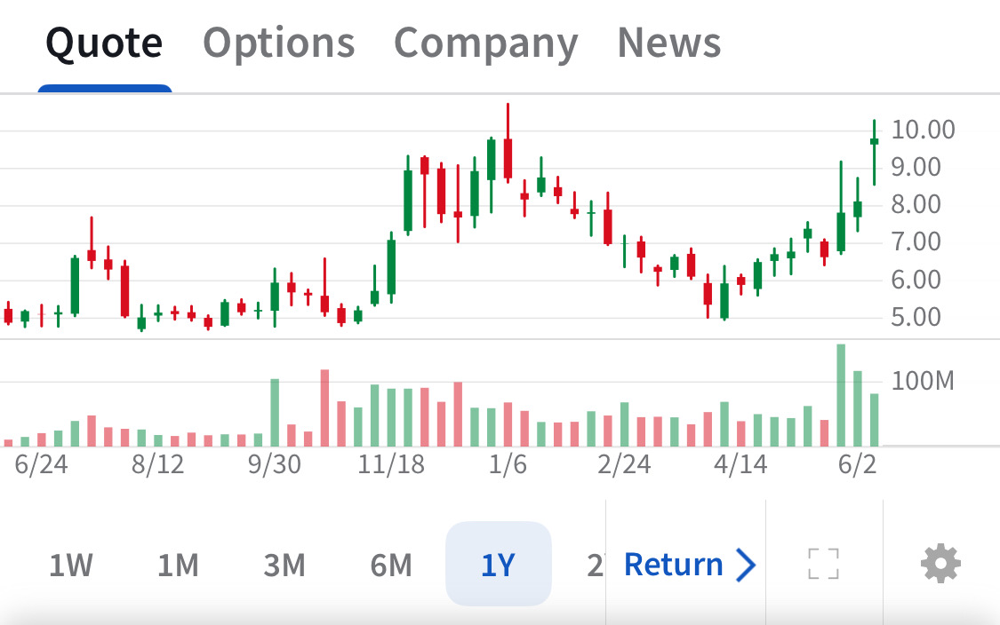

# Note -- June 11, 2025

$JOBY is challenging the $10 line again. I bought at $5 in November 2023 and added at $6 in March. I intend to hold regardless.

---

*Source: [Strategic Wave Trading Notes](https://stephentobin.substack.com)*
