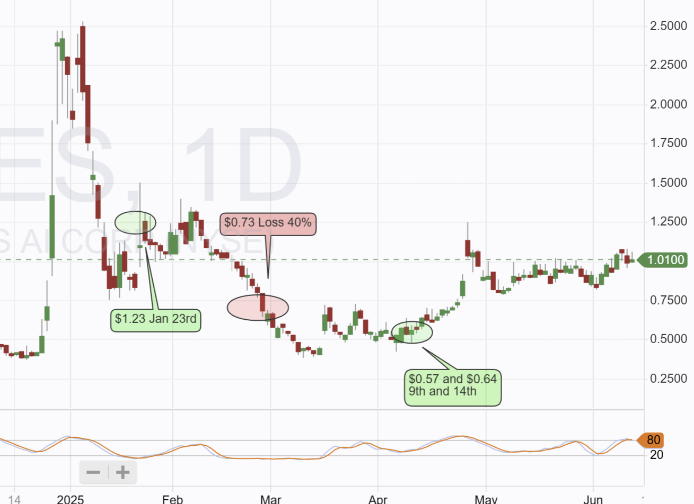

# Note -- June 12, 2025

Big news on $SES! 🔥 We're officially in the green on this stock, recovering from initial losses!

However, a recent Elec magazine article from South Korea has revealed a potential shift: SES AI may be moving away from EV battery cell manufacturing entirely to focus on lithium metal batteries for air mobility, including drones and Urban Air Mobility (UAM). Their Chungju factory, originally for GM EV cells, is now idle, and they have secured a drone customer. CEO Qichao Hu stated the EV strategy wasn't meeting shareholder responsibilities.

This could be a significant change in guidance, especially given previous plans for two automotive joint venture customers to move to C-Sample in H2 2025. It's unclear if those JVs are affected or where those C-Sample cells would be produced.

I'll be listening closely to the CEO's fireside chat with Deutsche Bank later today for more clarity. While we're in the green, this potential shift means it's time to re-evaluate my position. What are your thoughts on this strategic move?

---

*Source: [Strategic Wave Trading Notes](https://stephentobin.substack.com)*
