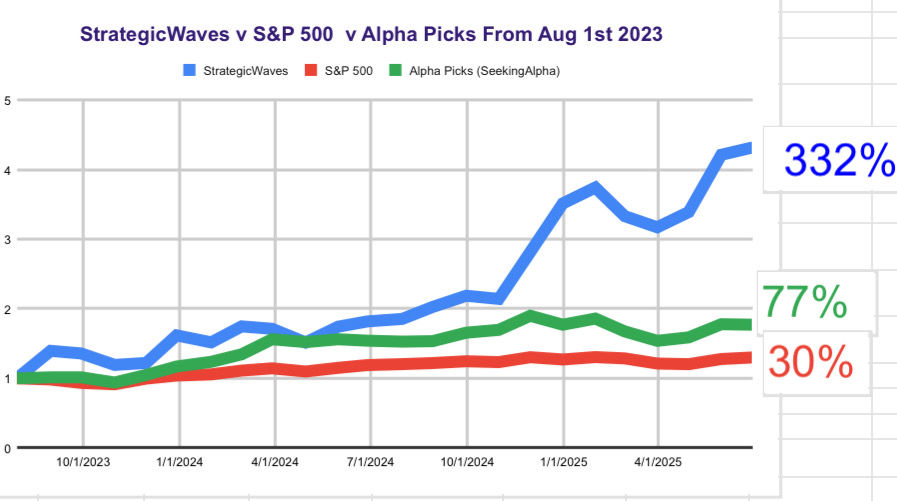

# Note -- June 17, 2025

Some trades are more satisfying than others. Last year ULBI was my worst performer down over 50%, I kept following developments and decided the fall was unjustified and bought some additional shares. Yesterday the position went into profit. It’s only 1% but the most satisfying 1% I have made this year! The rest of the portfolio continues moving nicely, up 2.5% in June against my target of an average 5.6% a month.

---

*Source: [Strategic Wave Trading Notes](https://stephentobin.substack.com)*
