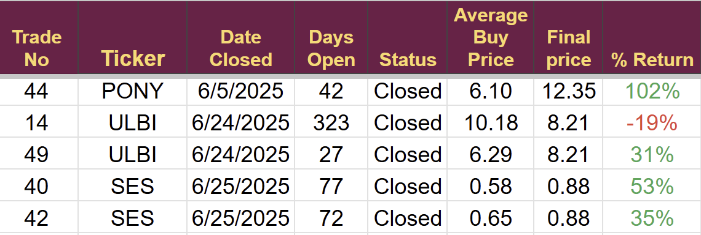

# Note -- June 26, 2025

June has been a very active month. After reviewing my Battery sector I decided to make some changes rotating out of ULBI and SES. It is the third time I have closed 5 trades in a single month in the two years since I started this project. Moderate returns but it has boosted the cash pile.

---

*Source: [Strategic Wave Trading Notes](https://stephentobin.substack.com)*
