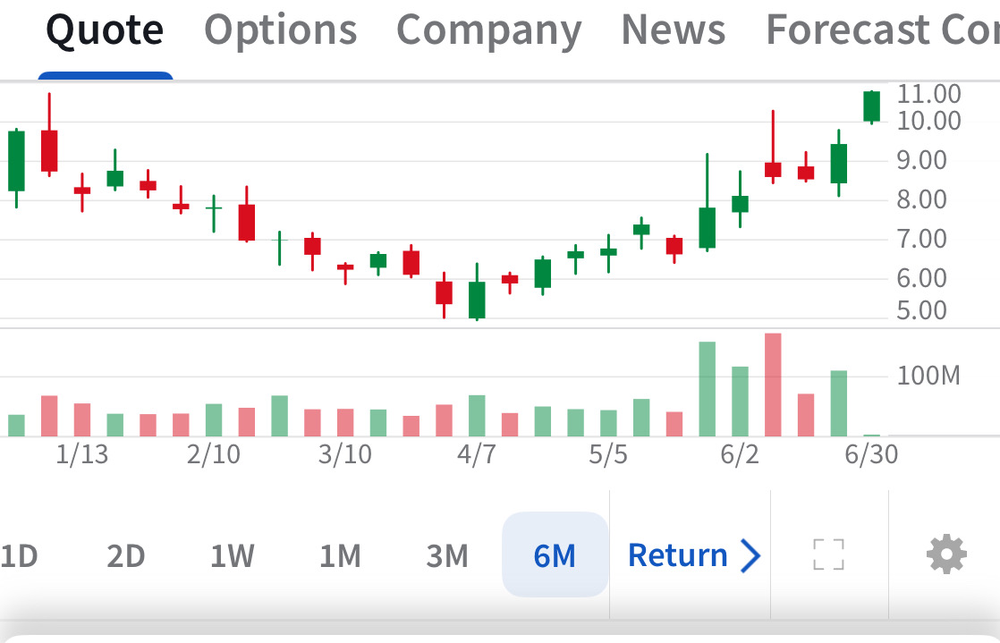

# Note -- June 30, 2025

JOBY jumps on the first flight in Dubai, ahead of schedule and probably a year ahead of Archer. It is one of my biggest holdings, but can it hold $10, it has failed multiple times in the past

---

*Source: [Strategic Wave Trading Notes](https://stephentobin.substack.com)*
