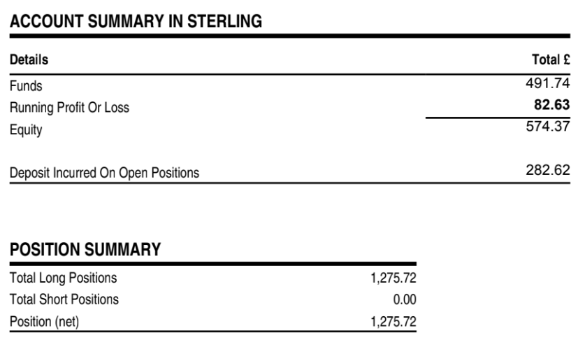

# Note -- July 10, 2025

My Spreadbetting project is into its second month. After learnings from last month I have refined my position size. Each position will have equity = to 50% of my available funds at the start of the month. With 4 trades a month that gives me equity = double my investment and leaves enoughb to cover drawdown. So far £500 invested and Profit = 15%.

---

*Source: [Strategic Wave Trading Notes](https://stephentobin.substack.com)*
