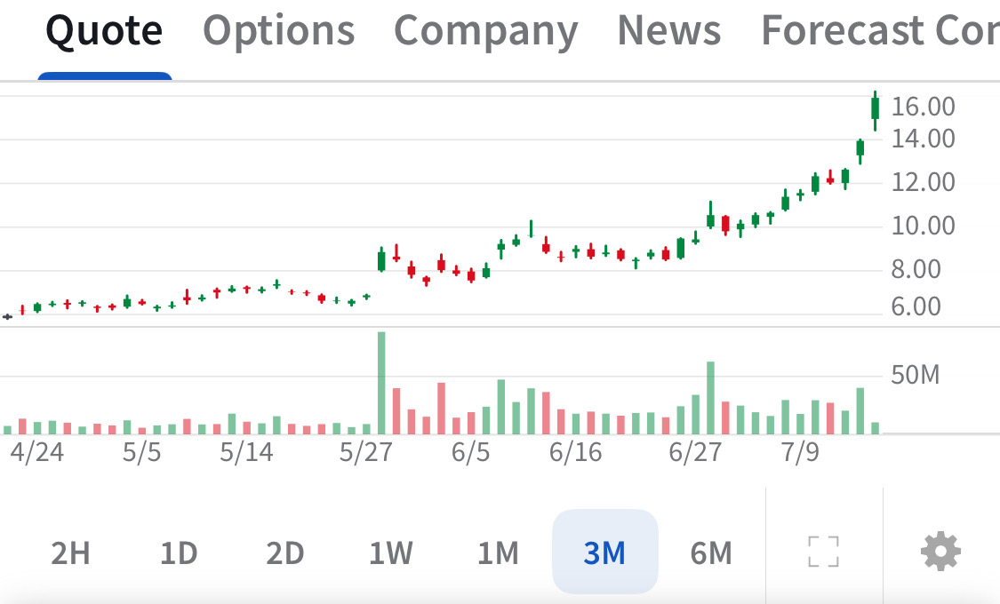

# Note -- July 16, 2025

Six of our 19 stocks have put on 100% in the last 90 days. Three of them are showing almost vertical price action and I will have to consider profit taking. Image is JOBY now my biggest holding after a 174% rise in 90 days

---

*Source: [Strategic Wave Trading Notes](https://stephentobin.substack.com)*
