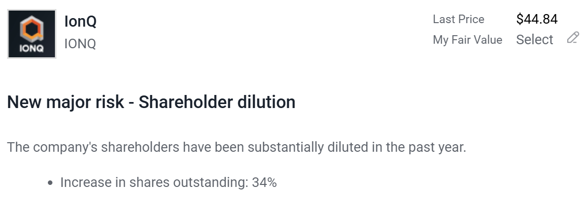

# Note -- July 18, 2025

In small caps tech companies there are two types of CEO, Founders and Professionals. Founders know the tech and Professionals are supposed to know business but typically are really good sales people. In my experience (I am generalizing here) Founders care about the company and its shareholders, Professionals care about themselves. Founders grow to slowly and Professionals try to grow to fast, I prefer to invest in founders. IONQ investors should consider themselves warned

---

*Source: [Strategic Wave Trading Notes](https://stephentobin.substack.com)*
