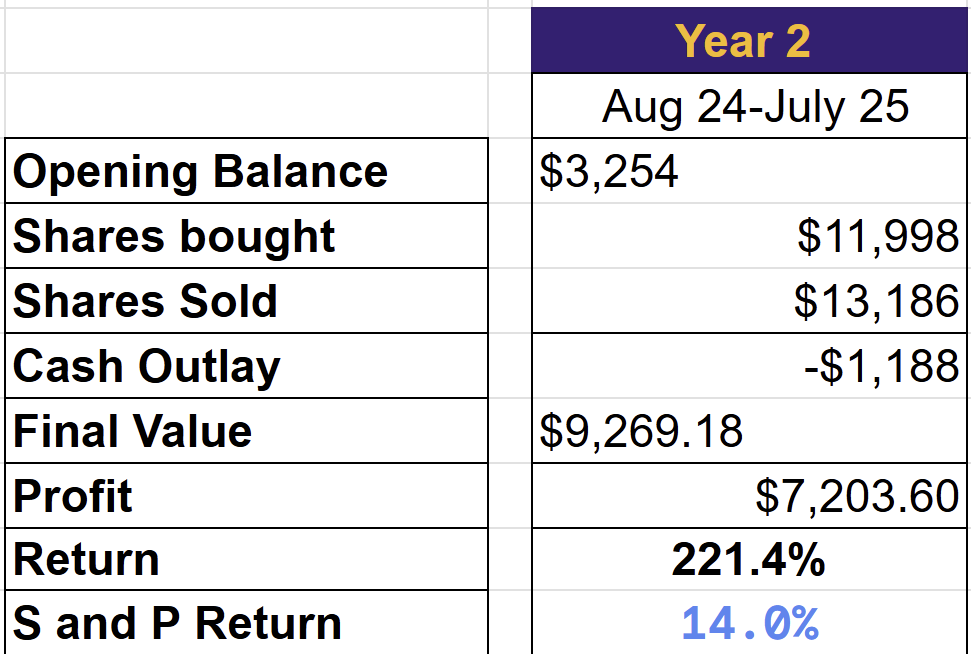

# Note -- July 18, 2025

Having a very busy day, published a trade alert post and bought the stock. Closed two trades (AMPX for 114% and DRO for 84%). Portfolio is now up 11.6% this month. Check out this performance for my second full year of reporting my results, which will end this month. It is a small account used to showcase my trading and provide me with auditable accounts.

---

*Source: [Strategic Wave Trading Notes](https://stephentobin.substack.com)*
