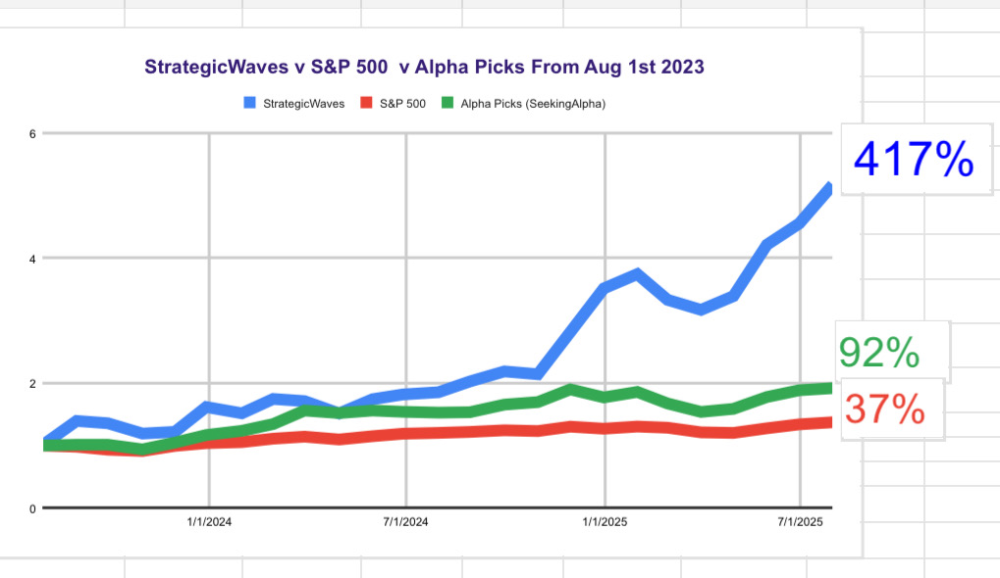

# Note -- July 23, 2025

Our biggest holding Electrovaya jumped 22% today, and this morning’s trade alert caught most of the move. I hope everyone got a piece of it. D-Wave jumped 15% and 18 out of 19 positions moved higher. The portfolio is flying up 13% in July. 

---

*Source: [Strategic Wave Trading Notes](https://stephentobin.substack.com)*
