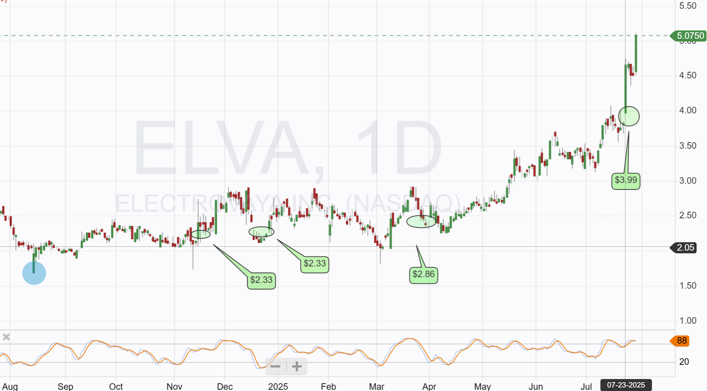

# Note -- July 29, 2025

Generally a poor day today. Most stocks in the portfolio down, some 10%. However Electrovaya (ELVA) is flying up 12% and as it is our biggest holding it has an outsized impact. Elva has secured new OEM customers in multiple vertical markets of late. Today they announced contracts with multiple OEMS involved in airport ground vehicles,commercial shipments starting next month. That is now 5 vertical markets, at the start of the year they only had 2. The daily chart shows all the places I bought and I still hold them all.

---

*Source: [Strategic Wave Trading Notes](https://stephentobin.substack.com)*
