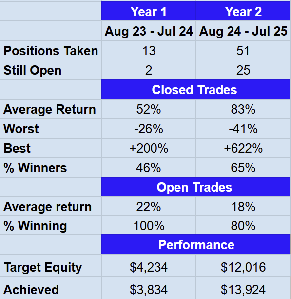

# Note -- July 30, 2025

Tomorrow is the end of the second year of my project to turn an investment of $250 a month into $100K in 5 years. It requires a return of 5.2% a month. Just beginning to analyse results and compare with year 1. After today’s Drone investment, I don’t expect any more trades this week, so most of the figures will not change. The portfolio is above target and has a lot of cash. I think we are well-positioned for year 3.

---

*Source: [Strategic Wave Trading Notes](https://stephentobin.substack.com)*
