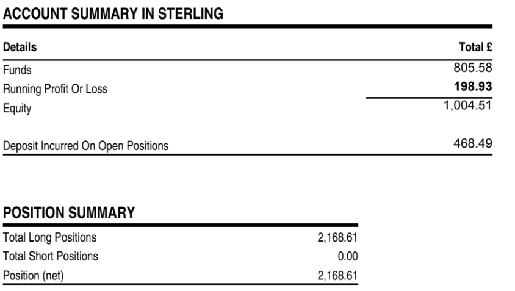

# Note -- August 13, 2025

The margin account experiment is going well. I have made three deposits of £250 on the first of June, July, and August. One trade closed for £72 profit and all others (12) still open showing a proft of £198.98, total funds are £805-thats the £750 deposit + £72 - expenses).

Margin means the account has £2,168 of stock that is a serious multiplier of both profits and losses. 

Too early for targets but I am hoping for great things.

---

*Source: [Strategic Wave Trading Notes](https://stephentobin.substack.com)*
