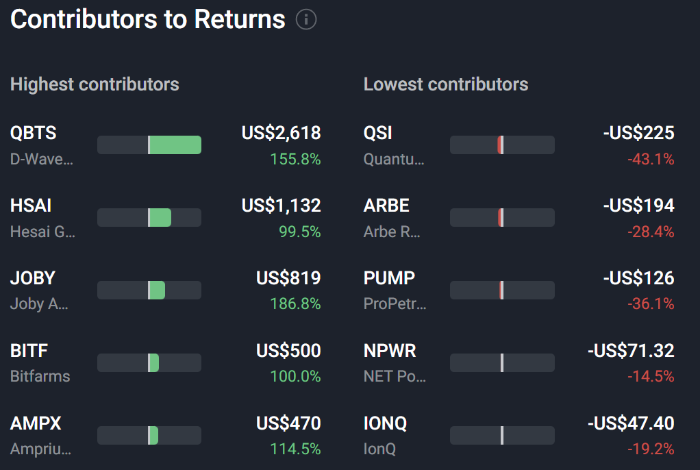

# Note -- August 21, 2025

I closed two losing trades yesterday $QSI and $PUMP. QSI was hit after poor earnings, and $PUMP has been suffering with the oil price. Probably won't be buying PUMP again, QSI on the longer-term watch list, but I have other medical device companies that look more interesting following earnings reports. Took a hit yesterday but just in profit for the month at +2%

---

*Source: [Strategic Wave Trading Notes](https://stephentobin.substack.com)*
