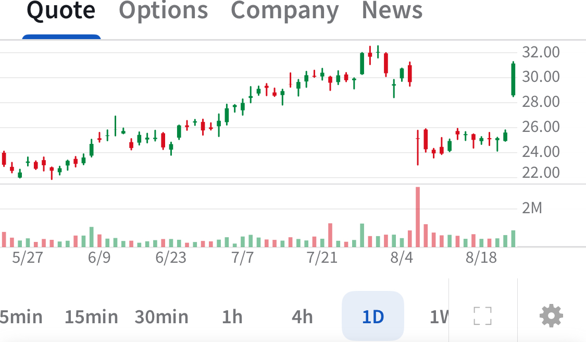

# Note -- August 22, 2025

One of our larger positions $ACMR jumped 20% at market open on the back of a regulatory filling posted with the SEC yesterday after close of business. The filing relates to the investor meeting that took place after the recent earnings call. Key points raised:

The Company has significantly increased its long-term sales target,

The Company achieved nearly 40% sequential revenue growth in Q2

The Company is fully booked with orders for Q3 and expects to be fully booked for Q4 as well.

---

*Source: [Strategic Wave Trading Notes](https://stephentobin.substack.com)*
