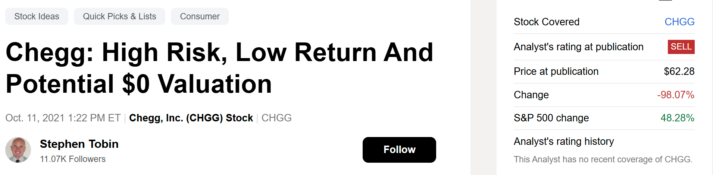

# Note -- August 23, 2025

Five years ago, I started publishing my financial analysis. I'm taking the chance to look back at some of my best picks.

In October 2021, I covered $CHGG with a piece “Chegg: High Risk, Low Return and Potential $0 Valuation.” At the time, the share price was $62.88. Today, it’s £1.20. It was clear the product was hopeless and unsustainable. The management was out of touch and in it for the money, not the shareholders.

I hope that article helped some of you exit this corrupt stock and save your money!

---

*Source: [Strategic Wave Trading Notes](https://stephentobin.substack.com)*
