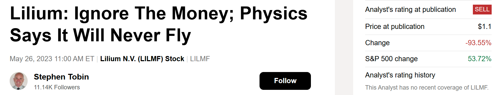

# Note -- August 25, 2025

August is looking 🔥! Our portfolio is up 8%, with our new Space investment already up 5%. The Drone stock from July is soaring at 150% (up another 7% today!), and our Battery investment jumped 8% today, bringing its total gain to 92%. My strategy? Dive deep into an entire sector and pick the clear winners. In 2023, I analyzed the eVTOL market and, while I picked winners $JOBY and $EH, it's often the ones you avoid that make all the difference, like Lilium in this case.

---

*Source: [Strategic Wave Trading Notes](https://stephentobin.substack.com)*
