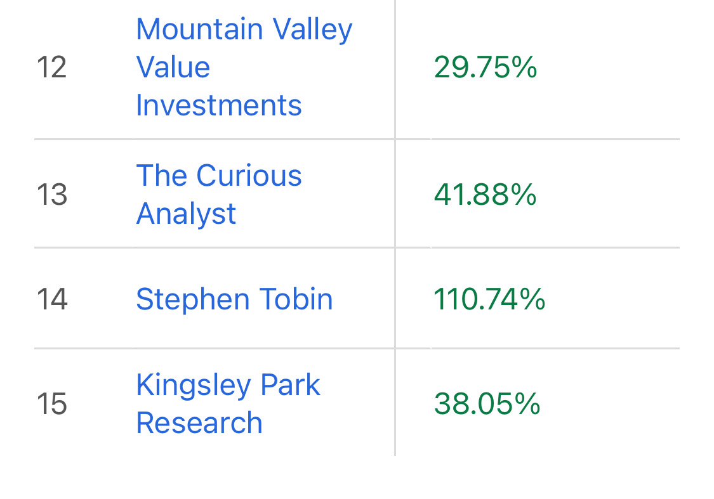

# Note -- August 29, 2025

I dropped from 3rd to 14th on the Top Analyst leader board but my average return grew 15 percentage points to 110%, pretty good for 22 picks in 12 months. I think September will be a great month, first two picks already identified. (The Top Analyst board is from the Seeking Alpha platform, the largest investing site in the world)

---

*Source: [Strategic Wave Trading Notes](https://stephentobin.substack.com)*
