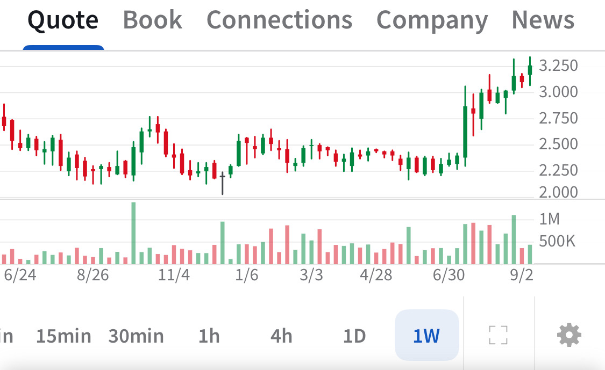

# Note -- September 11, 2025

NanoXplore pushed to a 12 month high dragging my portfolio into the green for September. Chart below is a weekly for TSE:GRA, the Canadian ticker we are in at $2.50

---

*Source: [Strategic Wave Trading Notes](https://stephentobin.substack.com)*
