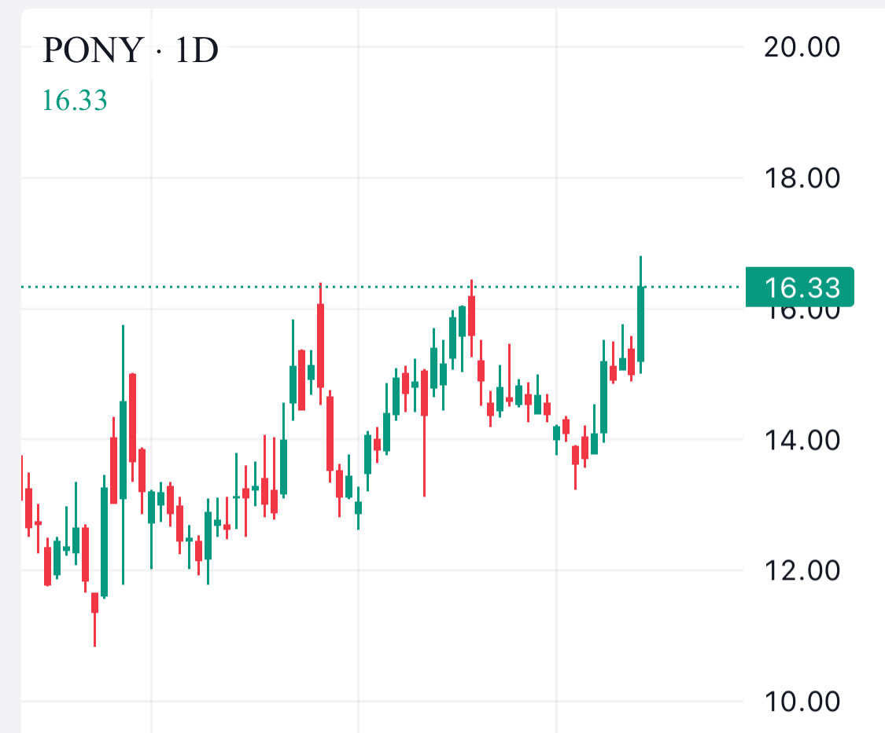

# Note -- September 15, 2025

$PONY moving nicely today, up 10% and testing a resistance line it has failed at twice before. A definite uptrend in place some great potential here I think. I remain long from $13.77 average. Next trade alert complete and buying tomorrow!

---

*Source: [Strategic Wave Trading Notes](https://stephentobin.substack.com)*
