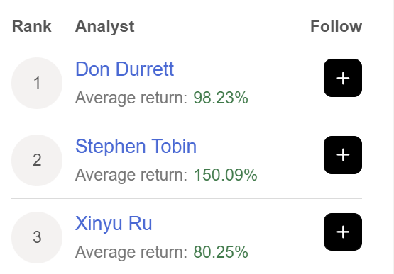

# Note -- September 17, 2025

Having a great trading week, 18 of 19 stocks showing a profit and 8 of them up more than 10%. I made it to number 2 on the Seeking Alpha Top Analyst list thanks to an average return per pick of more than 150% in the last 12 months. YTD standing at 62% and Annualized rate of return 134%, nicely above target. Next trade is almost ready but I'm interviewing a CEO tomorrow and a CFO on Friday just to check some issues.

---

*Source: [Strategic Wave Trading Notes](https://stephentobin.substack.com)*
