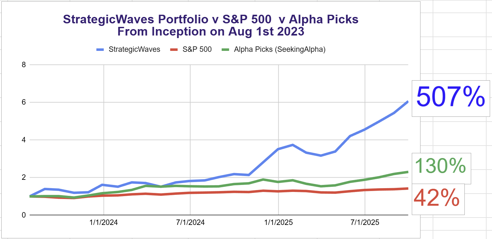
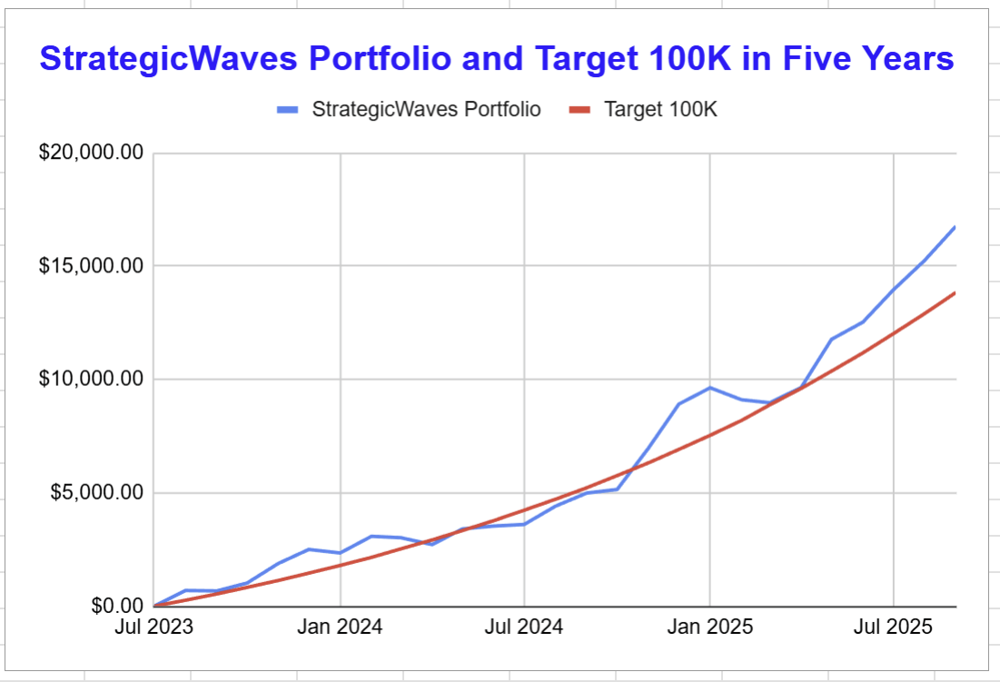

# Note -- September 18, 2025

A record profit day takes the portfolio over 500% for the first time.

5 of our 19 stocks up more than 10% only one is under water down 1%.

$250 a month to $100K now 2 months ahead of target.

---

*Source: [Strategic Wave Trading Notes](https://stephentobin.substack.com)*
