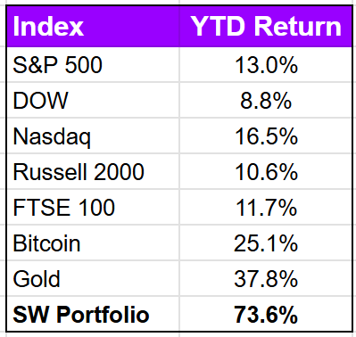

# Note -- September 19, 2025

After a record day yesterday driven by weekly moves of $ABAT (+29%),  $QBTS (+35%), $SES (+26%), and $ACMR (+21%) our portfolio is up +73% YTD. Way ahead of the indices and our next investment has been identified, our first true micro cap and second recycling company.

---

*Source: [Strategic Wave Trading Notes](https://stephentobin.substack.com)*
