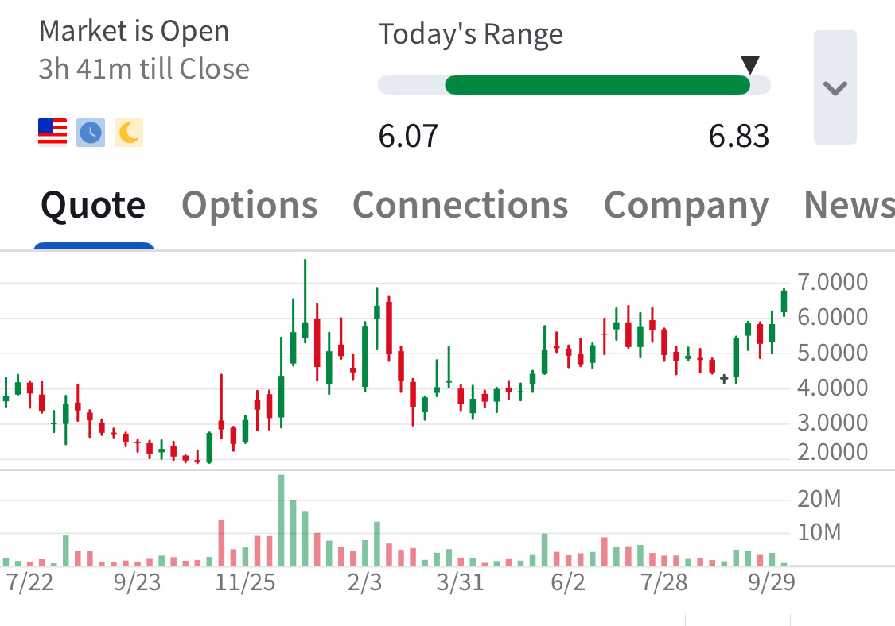

# Note -- October 6, 2025

Airship Holdings is one of the big movers pushing the portfolio higher today. Up 16% today and approaching long term resistance at $7, the chart is a weekly. Today’s move follows a large order with the US government hopefully the first of many. We are in at $5.06

---

*Source: [Strategic Wave Trading Notes](https://stephentobin.substack.com)*
