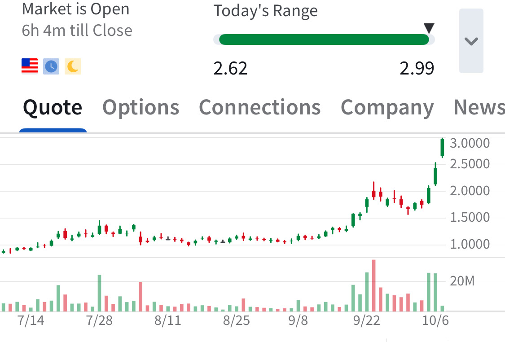

# Note -- October 7, 2025

SES smashes through the $2 resistance line and tops $3 on a +20% move today. Our position is up over 200%, holding for the time being.

---

*Source: [Strategic Wave Trading Notes](https://stephentobin.substack.com)*
