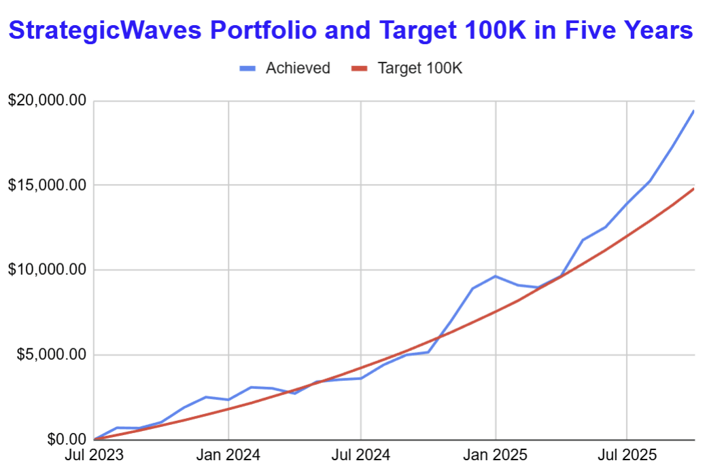

# Note -- October 10, 2025

My $250 a month to $100,000 in five years portfolio has hit a couple of milestones today. Year to Date return passed 100% for the first time in 2025, profit from trading hit a monthly record of $1,900 and we are now four months ahead of schedule. Not a perfect day with 9 of our 21 stocks in the red but the worst is down 4% and we have one stock up 20% with two more over 10%. This week I have been looking at investments where I didn’t make the most of the situation and how I will remedy that in the future. October is going very well with equity up an excellent 14.1% so far

---

*Source: [Strategic Wave Trading Notes](https://stephentobin.substack.com)*
