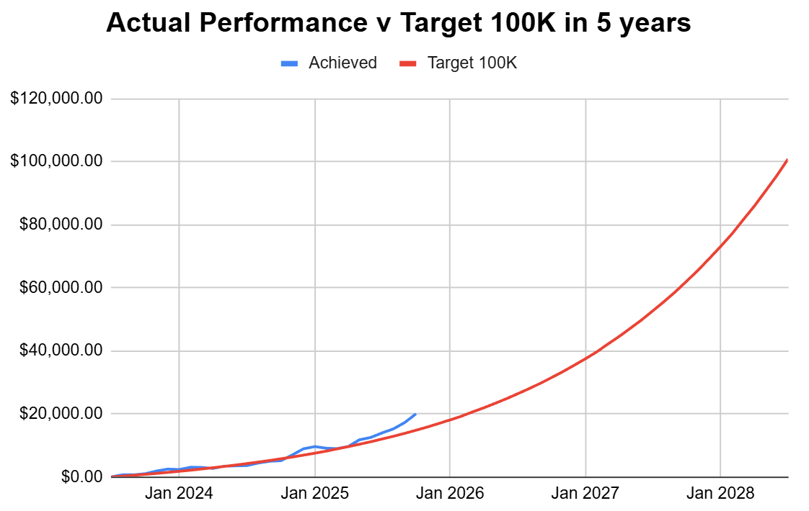

# Note -- October 14, 2025

It was a record profit day for the portfolio yesterday. $ABAT and $ASPI jumped +30%, $SMR and $ELVA 15%, all 21 stocks in the portfolio showed a profit.  The account, which started with $250 a month and aims to reach $100,000 in five years, passed $20K for the first time. That's 5 months ahead of target. The three trades taken in October so far are all in profit with an average return of 13%, and the five trades taken in September are all up with an average return of 72%. I am working on the next trades, one more this week and one next, or two next week if I can't finish the DD on this space stock in time.

---

*Source: [Strategic Wave Trading Notes](https://stephentobin.substack.com)*
