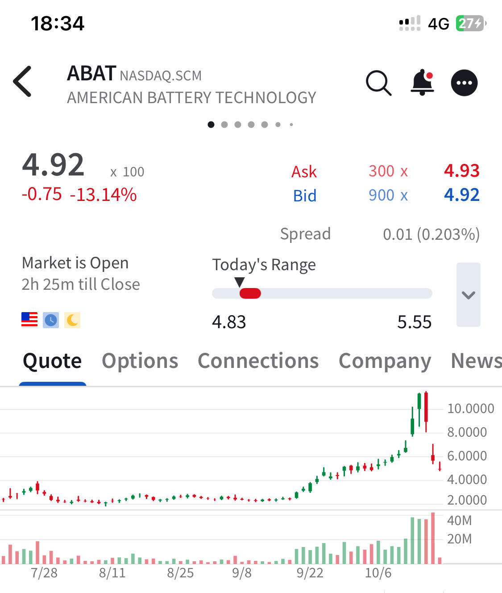

# Note -- October 17, 2025

Often things work out, we are playing a game of incomplete information so we never know everything and infer from what we see. I bought $ABAT for $2.48 sold earlier this week for over $10. I didn’t know they had a problem but could see the price had gone to quickly

---

*Source: [Strategic Wave Trading Notes](https://stephentobin.substack.com)*
