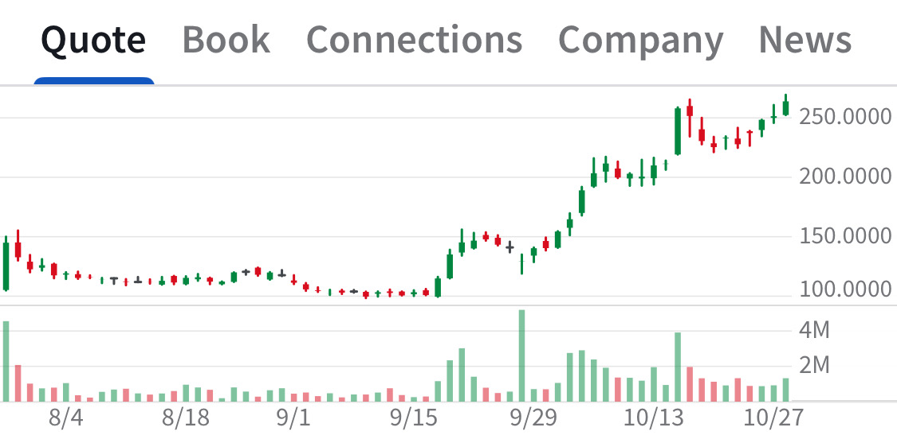

# Note -- October 28, 2025

Having a solid day. Our diversified small caps portfolio is going well with Nuclear, Robotaxi, and Recycling stocks showing +10% gains. This chart is our Fuel Cell stock bought at 156, up 70% in under a month, our only UK stock going really well. The portfolio is up 12% in October thanks to careful picking across regions and technology 

---

*Source: [Strategic Wave Trading Notes](https://stephentobin.substack.com)*
