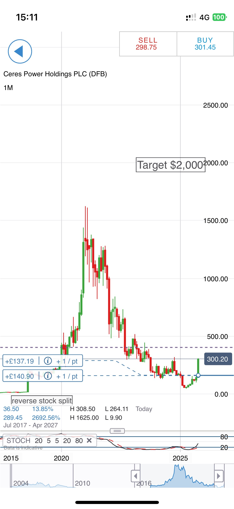

# Note -- October 29, 2025

Ceres Power is moving quickly today, its only competitor Bloom Energy released excellent Q3 results showing growing demand for electricity generation from Natural Gas. Ceres is a much smaller company than Bloom so could move much higher. This monthly chart shows the scale of the move and how far it could go. It is from my spread betting project and shows the entry points.

---

*Source: [Strategic Wave Trading Notes](https://stephentobin.substack.com)*
