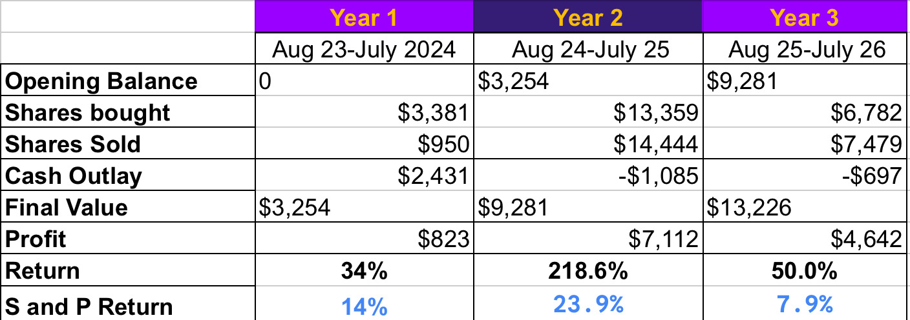

# Note -- October 31, 2025

October closed, a profitable but volatile month with the portfolio up 10%. It was also the end of the first quarter of my third year trading the $250 to $100,000 account. Image below shows some key line items from the accounts performance. It shows the account is generating cash and making quite extraordinary profits. You can see the benefit of compounding as we recycle the cash, taking profits and re investing. The key is good stock picking and decision making. Next week will be a busy week as we buy a couple of old friends, stocks that have made us good money in the past and now represent excellent opportunities to double up.

---

*Source: [Strategic Wave Trading Notes](https://stephentobin.substack.com)*
