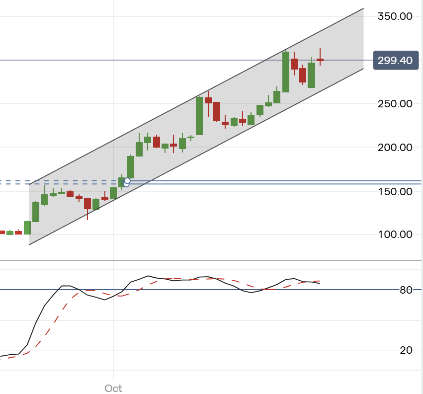

# Note -- November 4, 2025

Cerese Power $CWR, $CRPHY is up 91% since we bought it at $1.55 only 33 days ago. The chart below makes me a little nervous, it has traded in such a tight channel that I worry if the channel breaks it could fall quickly. These very tight patterns cannot persist for any lengthy period of time and as always I want to book my profits so may exit and look to buy again. The stock was definately my star buy last month

---

*Source: [Strategic Wave Trading Notes](https://stephentobin.substack.com)*
